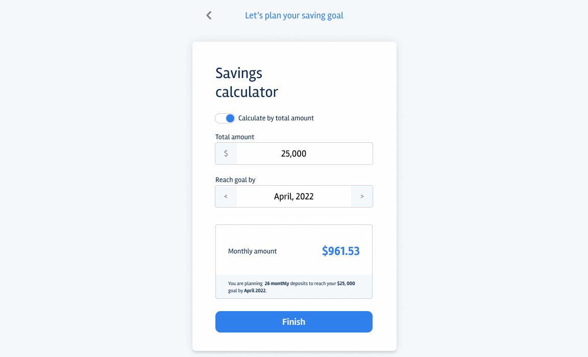

# Appboxo Frontend Take-Home Assignment
Appboxo helps any native Android/IOS application become Super App by providing easy access to Mini Apps.

MiniApps are basically performant web apps that have some super powers of native devices functionalities.

You will build a savings calculator that can become one of Mini Apps in our platform.

## Savings calculator

You will build a screen where the user can calculate their savings either by defining goal and saving monthly deposit for certain amount of time.

In it, the users choose (i) mode by which calculation is done,  (ii) the value they want to reach or deposit monthly and (iii) the date they plan to reach the goal.

When the users change the value of any of the inputs, the monthly deposit value is calculated and displayed to them.

Wireframes are available [here](https://www.figma.com/file/IaZtDQvkcdancor16W4EQ24J/Savings-calculator?node-id=0%3A1)

## Instructions

We expect you to:

1. Develop the page as close as possible to the mockups, both on mobile & desktop.
2. Implement business rules.
3. Use any modern Javascript framework (we like React 😀).
4. Use your own stack (redux, jest, styled-components, typescript etc).
5. Test the codebase.
